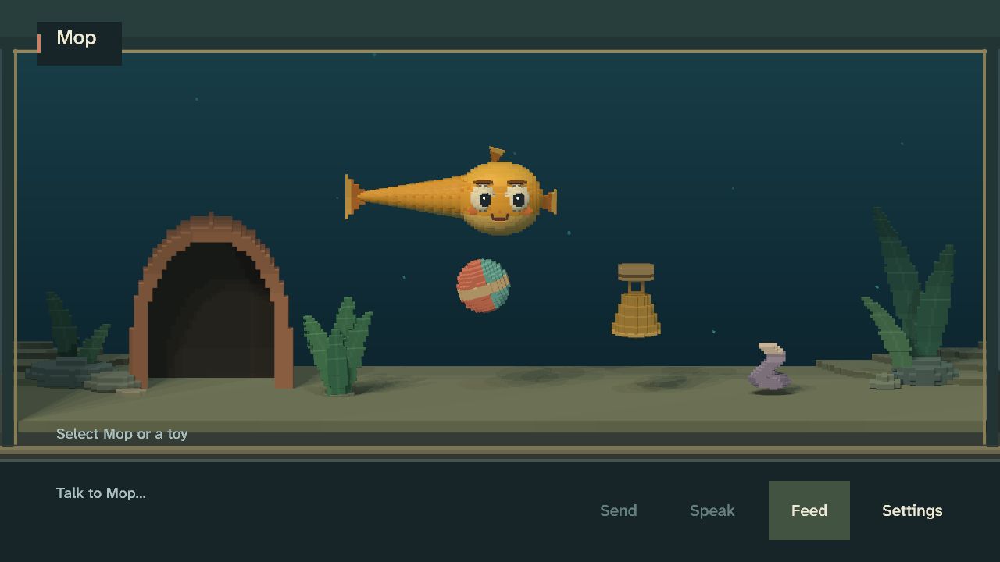
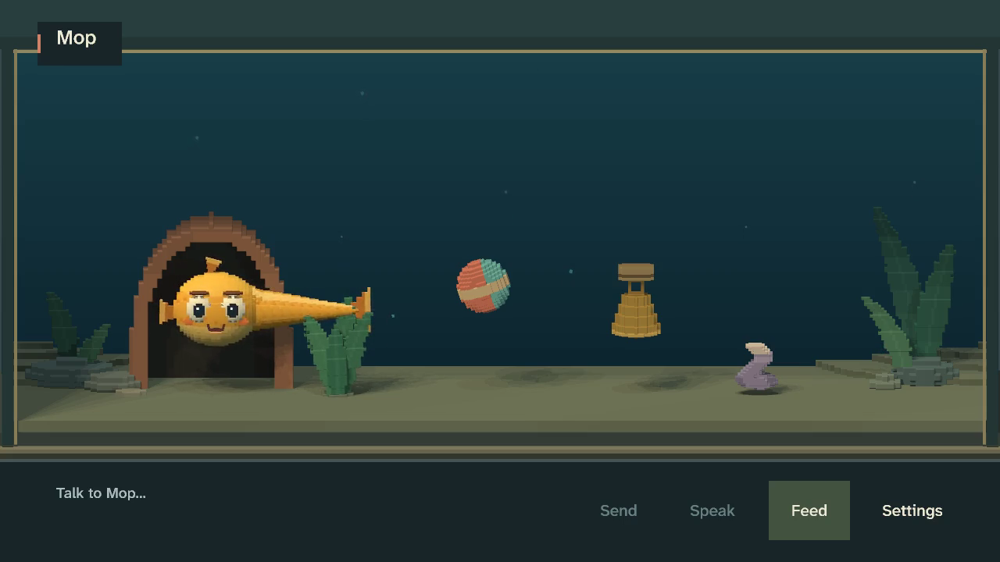
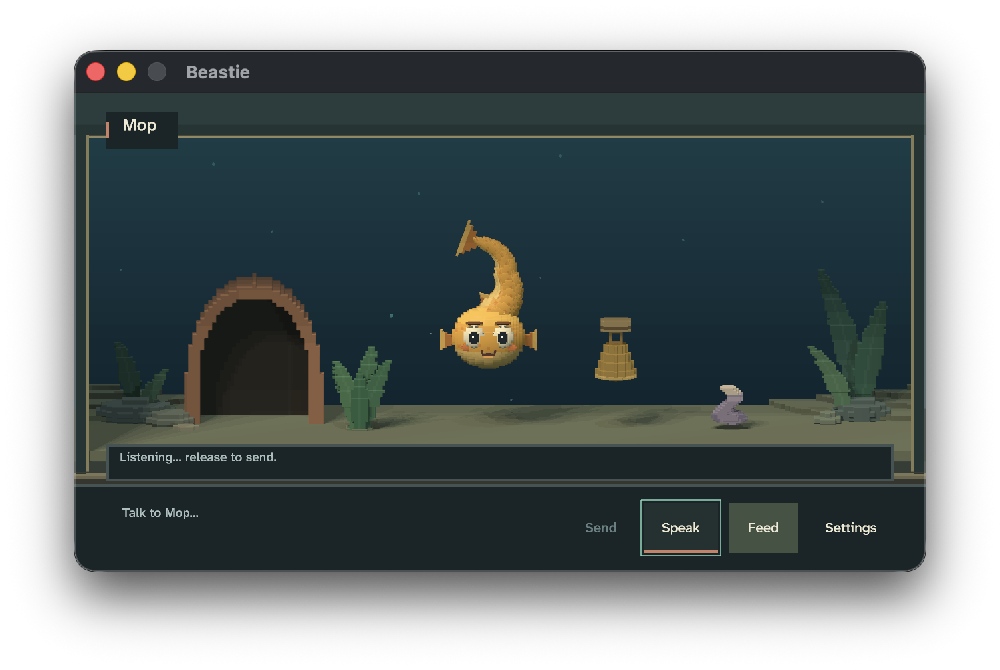

# Creature presence and care: implementation review

Date: 2026-09-08. Implementation and sampled native review complete.

This implements the seven accepted findings in
[the holistic review](feel-review-holistic-20260908.md) under the authorized
[creature presence and care contract](creature-presence-and-care.md). The user explicitly
authorized every change and continued implementation without another approval step.

## Final design

- Empty, unfocused composition has no filled inset. Editing retains the existing field and fixed
  hit targets. A short care invitation yields to hover, focus, speech and notices; only direct
  player care dismisses it. Autonomous play or consumption of old food cannot dismiss it.
- Microphone hover explains disabled recovery and hold/release operation. Disabled controls remain
  inert; reachable Settings focus carries the recovery explanation. Helpers use the reserved
  status strip, with technical and uncertain-hearing feedback taking priority.
- New aquariums stagger toy positions. The bell carries an integral cork float, cloth bends toward
  the substrate, and the ball remains buoyant. Old habitat coordinates are preserved. Toys now use
  cached exact presented mesh picking, including carried rotation and the bell's open loop.
- The shelter opening accommodates the full head and crown and sits behind the interaction plane.
  The rest destination and creature behavior remain authoritative and unchanged.
- Semantic mix roles distinguish ambience, UI, physical effects, creature calls and speech. Only
  creature calls and speech duck the bed, with bounded authored attack/release envelopes.
- Audio evidence retains actual resolved bytes, identities, owners, accepted lifetimes and gains.
  Reconstruction honors cancellation, suppression, mute and ducking. Missing/tampered sources,
  clipping and unrepresented starts reject evidence instead of producing a misleading soundtrack.
- Deferred words re-check the current direct-care handoff. Replacing the old owner cannot give
  older speech permission to erase a newer refusal, toy approach or food action. Unrelated private
  life still cannot hold words indefinitely; original expiry and immediate new care are preserved.

## Iteration and independent review

The first native preview exposed a remaining gap between the cloth and its shadow. The second
preview lowered the new default to `(8250, 10000)` and relaxed the mesh further. Independent review
also caught two interaction defects before final recording: proxy toy volumes did not cover the
new cuff/cork or follow rotation, and autonomous toy events could dismiss the invitation. Both were
corrected with regression coverage.

Integration review also found that the pre-existing microphone-enable confirmation was permanent
and omitted release behavior, which could mask the new helper. Its final treatment is a bounded
four-second confirmation that already explains hold/release, after which ordinary state guidance
returns. This is exercised by the final direct-input pass.

Audio review caught an evidence edge where playback could start and stop between snapshots.
Started source metadata and bytes are now retained, and reconstruction explicitly rejects that
insufficient timing evidence. This is a bounded frame-clock reconstruction, not sample-accurate
capture of a device buffer. No native result is silently promoted through that guard.

The first integrated interaction-chain capture was rejected because its final talk arrived at
`01:00.483`, inside the cooldown of the correctly deferred acceptance at `00:31.233`. The old run
accepted those words at `00:27.416` and therefore had enough idle time. The final quiet wait now
lasts 34 seconds instead of 30, preserving both refusal input times and allowing the final
active-TTS cancellation assertion to exercise a real source. The failed attempt remains in
`target/feel/presence-final-01/interaction-chain/attempts/attempt-01/`; it does not count as accepted
capture evidence. Runtime cooldown was not weakened to satisfy the fixture.

Independent visual, causal and audio reviewers examined the promoted evidence. The review uses
sampled native frames, dense sequences and synchronized traces. Neither the assistant nor those
reviewers can certify full-speed human perception, host listening, unaided discovery or physical
controller comfort. These limits remain explicit and do not imply an observed runtime defect.

## Evidence and dispositions

Before: `target/feel/holistic-20260908/`, seven seed-42 native experiences from the original review.
After: `target/feel/presence-final-01/`, same baseline scenarios, seed, viewport and fake backends.
The two promoted opening/quiet experiences remain there; repaired interaction and remaining
baseline experiences are under `target/feel/presence-completion-01/<experience>/<experience>/`.
Constructor toy positions are an intentional difference; fixture-backed existing saves retain
their original coordinates. The old reference soundtrack is not used as a faithful audio baseline.

Native UI previews: `target/captures/presence-01/` and `presence-02/`, each 28 Normal/Large captures
from `cargo xtask dev --fake-ai`. The second contains final visible geometry and helper placement;
subsequent exact toy picking and player-only invitation dismissal are verified separately.

First-five-minutes comparison: berry consumption stays at `00:54.166`. Ball contact moves from
`01:06.233` to `01:04.233`, consistent with its new canonical position. The shared-ball callback
remains memory-backed and the five-minute run retains ten autonomous starts. At `03:00`, the crown
has dark clearance below the arch and the complete face/body remain visible. The first reference
reconstruction retains 11 sources, has output available throughout and peaks at `0.421173`, with
zero clipping and no limiter.

The seven accepted baseline experiences total 46,716 frames, 778.600 seconds and 247 hashed
artifacts. Every promoted artifact hash/size validates; all use seed 42 and the declared native
1280x720/60 fps recording. Two debug executable hashes occur across the integrated/rebuilt
captures, so byte-identical executable provenance is not claimed. Each manifest retains its exact
hash, commit and dirty state. Both builds contain the same accepted visual/causal/audio changes;
the later final microphone-confirmation adjustment is covered by fresh native input passes.

| Finding | Implementation and observed result |
|---|---|
| H1: care discovery | Empty composition is quiet; direct body selection opens care, Comfort dismisses the invitation, and editing restores the field. Native food drop and deferred typed submission succeed. |
| H2: voice guidance | Disabled hover/click explains Settings recovery without capture. Enabled hover explains hold/release; actual acquisition shows Listening, and release produces an honest no-speech result. Toggle notices expire. |
| H3: belongings | Native overviews show staggered buoyant ball, supported bell and relaxed low cloth. Actual bell-loop targeting opens its own context. Saved moving/carrying state round-trips exactly. |
| H4: shelter fit | Exact first-five `03:00`, quiet `02:12`, dense entry `02:42–02:49.5` and exit `03:50–03:57.5` show crown clearance and connected face/body in front of the rim and neighboring planting. |
| H5: semantic sound priority | First-five bubble `00:15.016–00:16.016` leaves bed gain unchanged; all 1,165 isolated bubble frames remain unducked. Quiet observation contains no unexplained ducking. |
| H6: faithful audio evidence | Repaired interaction speech starts `01:04.516` and stops with Comfort at `01:05.316`. An independent comparison of 310 subsequent PCM samples matches bed plus affection exactly, with no cancelled speech tail. |
| H7: current direct owner | Refusal #2 retains Bell destination/Approach from `00:27.400` until a new direct refusal at `00:30.433`. Older speech submits only at `00:31.233`, after the safe boundary. No rejected owner produces a positive toy payoff. |

The reference mix remains unclipped in every accepted baseline experience, without a limiter;
the largest peak is `0.635435`. Relationship playback at `00:48.300` records speech gain `.7`,
bed `.109438`, creature affection `.275547`, and physical food contact `.49` concurrently. Speech
attenuation therefore follows semantic role rather than silencing the contact payoff.

Bad conditions retain worker-unavailable fallback at `00:03.050`, acoustic uncertainty at
`00:12.100`, and recognizer failure at `00:17.150`; neither failed hearing case emits gameplay
events. Ball payoff precedes deferred speech, and ordinary care/movement continue. Relationship
return and direct interruption retain typed history evidence. The original no-AI run still has
482 fallback-caption frames; only the separate subtitles-off variant may support a wordless claim.

## Second-pass breadth and quiet life

`target/feel/presence-final-02/relationship-breadth/` contains six promoted saved-history/new-world
cases. Trusted berry consumes at `00:10.016` and completes at `00:11.016`; mushroom grudge rejects
at `00:09.016` and completes at `00:10.016`, both backed by seeded memory and belief. Familiar
ball/cave/plant visits begin at `00:00.983` from existing visit evidence and complete at
`00:08.000`, `00:10.000` and `00:09.000`. The seeded saves retain their old toy row. Shelter frames
still contain the head inside the enlarged aperture without the earlier blocked-entrance read.

Shared-ball creates history at actual contact `00:06.000`, returns at `00:14.016–00:22.016`, and
starts a callback backed by memory #1 at `00:54.033`. New player play at `01:00.066` interrupts it
immediately and pays off at actual contact `01:02.066`. This new world uses staggered defaults;
it is not evidence of a saved-coordinate migration. The six cases retain 116 verified artifacts,
contain no speech, and peak at `0.377664` with zero clipping. Familiar ball/plant visits do not
invent a success cue; cave contact at `00:04.000` does not duck the bed.

The second quiet seed is
`target/feel/presence-final-02/quiet-seed-4201/quiet-observation-seed-4201/`. Its thirteen bubbles
and sparse sock/ball/bell contacts preserve an unducked bed, including all 749 bubble-active
frames. Six retained sources peak at `0.179319`, with no clipping or speech/creature chatter;
all 35 artifact hashes/sizes validate. Sampled frames preserve self-directed movement, contact
and quiet intervals without filling the aquarium with extra effects.

The dedicated subtitles-off variant is
`target/feel/presence-final-02/nonverbal/relationship-over-time-nonverbal/`. All 3,256 frames have
subtitles disabled, no caption owner and no speech playback. Physical and creature cues remain
present. The first return at `00:24.066–00:32.083` starts with notice; the repeated return at
`00:44.133–00:52.150` begins with anticipation backed by memories #3/#5 and the return belief.
Sampled frames show turn, posture, approach and contact without a creature caption explaining
them. A brief `Local AI unavailable` notice at `00:45.166–00:50.150` remains external UI feedback. This supports nonverbal causal continuity; it does not certify human attachment
or recognition of every emotional beat at full speed.

Across both canonical passes, 15 promoted experiences contain 69,105 frames, 1,151.750 seconds and
424 artifacts. Every listed hash and size validates, every video is 1280x720/60 fps, and every
reference mix has zero clipping without a limiter. Three debug executable hashes span the captures;
the final build is `83b919951c394a28a3983a31434f2e7f1225b578334ccae6f44c908172378579`.
The second-pass breadth, quiet and nonverbal captures all use that final build. Artifact frame
rate describes recording, not a hardware performance benchmark.

## Direct input and evidence limits

Final input uses nonpersistent 60-second sessions, the actual macOS pointer/keyboard path and the
default microphone. Normal `target/feel/presence-native-final-03/` records 3,606 frames: Comfort
at `00:03.300`, acquired listening at `00:19.166`, release/no candidate at `00:20.500`, berry drop
at `00:32.133`, typed deferral at `00:36.600`, then food consumption and talk acceptance at
`00:47.000`. The microphone is disabled again before exit. `06a`, `06b` and `06c` show the real
ready/listening/recovery states, and `07`/`08` establish bell-loop targeting/context. A post-submit
empty field is expected; input and event traces establish submission.

Earlier raw input attempts remain diagnostic. The first helper dropped standalone move/down/up
events when its process exited; allowing 150 ms for delivery fixed that. Another blind-timed run
contains an Escape/mouse/focus burst immediately after acquisition, so its named screenshots do
not prove a controlled hold. A state-awaited probe reaches listening within 0.569 seconds of
starting the helper, including helper overhead, while observed frames advance. Its clean release
returns through recognition to idle. This does not establish a material runtime stall, and no
speculative audio-thread rework was accepted. Scripts must await real acquisition before timing
release, and reviewers must compare each named screenshot with its actual input/state evidence.

Large `presence-native-final-04` independently confirms microphone and text bounds, but its fixed
coordinate Comfort click missed the menu after it relocated above the creature. It is not counted
as successful Large care. The final focused-action retry, `presence-native-final-06`, records
3,606 frames and closes that gap: Comfort at `00:06.933`, acquired listening at `00:22.966`,
release/no candidate at `00:24.333`, and microphone disabled again at `00:28.033`. Bell-loop
selection plus explicit Play produces an honest refusal at `00:33.416`; new care interrupts that
owner at `00:34.983`. Berry drop at `00:37.900` precedes typed deferral at `00:43.033`, with
consumption and talk acceptance together at `00:54.000`. `10a-edited-compose` shows the filled
field and visible “Hello Mop.” before submission, with no Large-text overlap.

Normal 03 and Large 06 are two valid direct-input passes after the final microphone confirmation
change, in addition to the eight final-build canonical recaptures. Each raw input video contains
exactly the 3,606 frames in its state stream, at 1280x720/60 fps. These are raw host-input bundles,
not additional canonical suite manifests. Earlier failed/missed attempts are not counted as
acceptance, and no native games were run concurrently.

Actual acquisition/release does not certify recognition of a human utterance, physical listening,
device latency, controller comfort, unaided first-use discovery or full-speed emotional judgment.
macOS Metal debug evidence does not certify Windows/Linux drivers or lower-end GPU performance.
No release binary, installer or model bundle was rebuilt.

## Persistence and regression evidence

Core tests drive real contact to produce a moving ball and a carried sock, preserve deliberately
non-default saved coordinates, round-trip the complete state, and compare ten continuation ticks
and events. They require no duplicate payoff and eventual settling/release. Constructor tests
require catalogue and mutable toy positions to agree. Existing view tests cover carried projection.

Deferred-owner tests cover accepted play, refusal, food, cooldown-only deferral, repeated
replacement/expiry, typed/spoken parity, immediate new comfort and save/load. In an isolated copy
with the old owner-inequality shortcut restored, three new regressions fail while 46 other session
tests pass. The shared checkout was never reversed for this comparison.

Mesh tests cover shelter clearance, hollow plant/cave gaps, bell-loop gaps and carried-cloth
rotation. View/input tests cover state explanations, disabled access, focus reachability, Large
bounds, technical feedback priority/expiry and player-only invitation dismissal. Audio tests cover
semantic ducking, discarded commands, bounded envelopes, interrupted/muted sources, missing output,
overlap, retained source integrity and clipping visibility.

## Final adjudication

All seven accepted findings and the additional picking, invitation, notice and audio-evidence
fixes are implemented. Two successive final native input reviews and the final-build breadth,
quiet and nonverbal captures reveal no further known material improvement in the reviewed scope.
Independent code, visual, causal and audio findings have been adjudicated and resolved.

The complete rubric was reconsidered: interface hierarchy and focus preserve clear direct care;
acknowledgement, anticipation, contact payoff, refusal and recovery retain truthful ownership;
shared history and development remain evidence-backed with and without creature language;
autonomous movement and quiet intervals survive; shelter/body/gaze and toy silhouettes remain
readable in sampled motion; semantic sound priority, cancellation and worker/hearing failure
preserve graceful recovery. These are strengths and explicit non-findings, not proof of human
emotional response or untested hardware performance.

`cargo xtask verify` passed 516 tests, 27 dialogue fixtures, 11 STT fixtures and spoken-input
replay. The existing macOS compact-unwind linker warning remains non-fatal.
The visible shell was exercised through `cargo xtask dev --fake-ai`, the synchronized feel suite,
and final actual macOS input. No release or model bundle was rebuilt.
