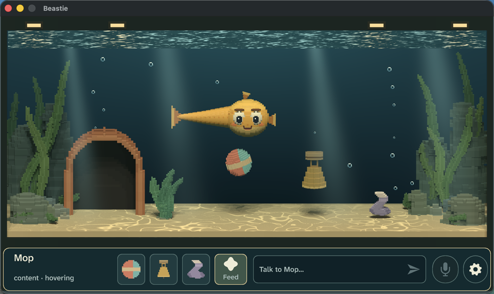
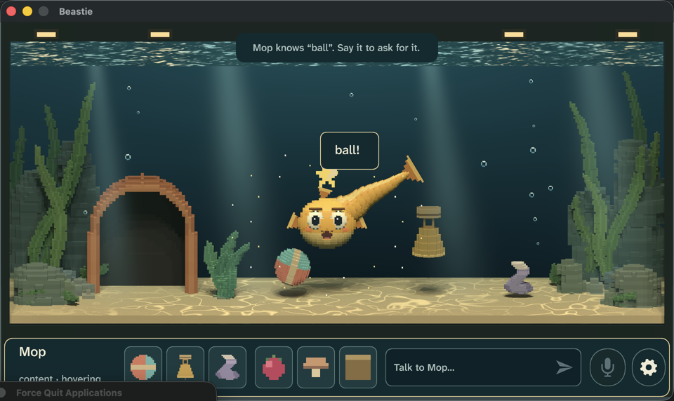
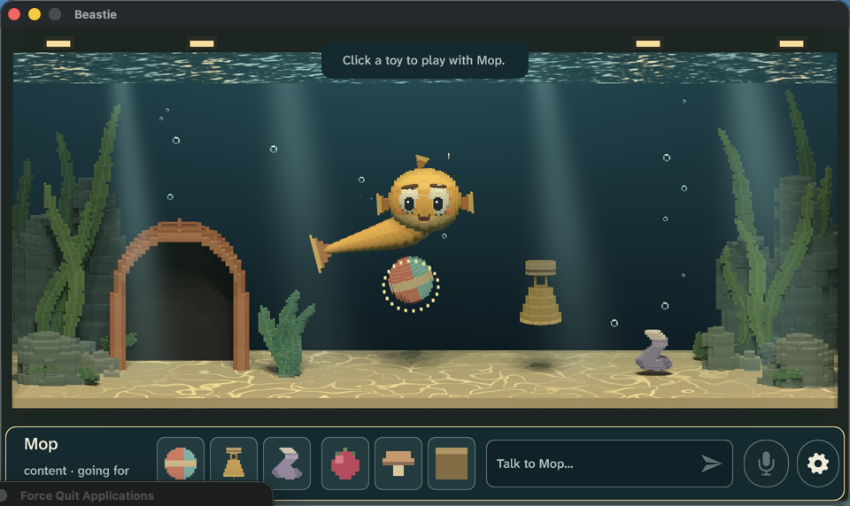
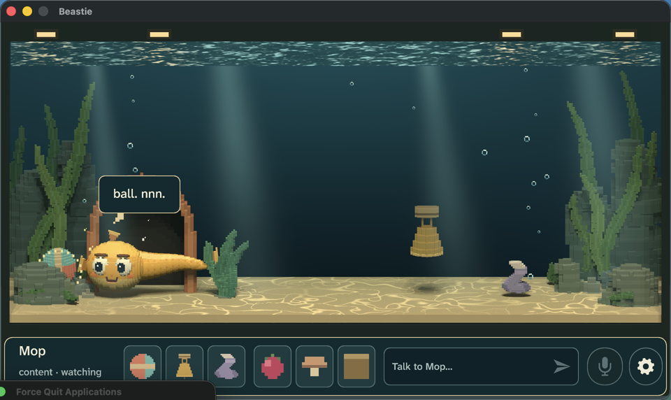

# Fun feel review, 2026-10-04

Review of the [fun rework](fun-rework.md) on the native debug game (macOS, Metal, M5 Max). The
owner's verdict was that Beastie did not feel good to play: Mop ignored input or answered late,
chat was generic and teaching was impossible, Mop's intent was unreadable, the opening had no hook,
some actions needed two clicks, and above all it was not fun. This record covers what changed,
how it was measured, and what remains for a human to judge. The owner's own playtest
([brief](playtest-brief-fun.md)) is the final judge.

## Before and after

At the start of the pass (`02ad95a`): clicking Mop opened a half-screen menu, Play opened a second
one, and feeding took three clicks. Moving the mouse cancelled an accepted play order, so players
clicked again. Feeding took 10–18 s. Typing "hi mop, this is your ball" produced "hm. rude giant."
with a "Local AI unavailable" banner; nothing the player said could be learned. Most idle time was
a 16–32 s drift labeled "hovering".

## Measurements

### Latency (live OS input, scripted with `cliclick`, event trace timestamps)

| Measure | Budget | Result (runs C, D) |
|---|---|---|
| Input to visible reaction | ≤ 100 ms | Same frame: every input type emits a presentation cue in the command that handles it (`every_player_input_is_acknowledged_in_the_same_frame`); measured 0.06 s from the scripted click including driver time |
| Pet | ≤ 1.5 s | 0.05–0.07 s |
| Nearby toy | ≤ 1.5 s | 0.06–0.33 s |
| Hand-fed food | ≈ 1.5 s | 1.43–1.71 s |
| Cross-tank toy | ≤ 3 s | 1.41–1.51 s |
| Pointer motion cancelling an action | never | never (`pointer_motion_never_interrupts_an_accepted_toy_interaction`) |
| Clicks for pet / play / feed | 1 / 1 / 1 | 1 / 1 / 1 |
| Dead world clicks | none | none: empty water taps the glass, open menus dismiss and act |

### Blind readability

A fresh model reviewer saw only the tank (rail, hints and labels cropped) and named Mop's
activity and want per frame; answers were scored against the rail's own labels and the traces.

| Round | Change before it | Correct |
|---|---|---:|
| 1 | first pass | ~5/14 |
| 2 | refusal bubble, play sparkles | ~6/12 |
| 3 | intent rings, bigger bubbles, fixed brows, "!" glyph | 10/12 |
| 4 | floor ring for foraging, brow sign fix | 11/12 |
| 5 | random frames from ten-minute run C | 7/10 |
| 6 | spoken refusals crossed out, glossy chased bubble, snap pop | see run E below |

Round 5 sampled real play rather than staged moments; its misses were a spoken refusal shown only
as text and a bubble chase whose bubble read as an empty ring. Both were fixed before round 6.
The reviewer consistently read "?" name bubbles, speech in Mop's learned words, refusals with a
crossed-out bubble, rings on targets, and sleeping as high-confidence. Idle floating with no
effect is read as idle, which is correct.

### Dialogue

The local model (Qwen3.5 0.8B Q4) and the composer were hillclimbed on 47 frozen speech cases
([log](../evals/dialogue/speech/log.md)): from 0/32 (every learned-word line fell back) to 31/32
train and 15/15 validation. In live runs the model answered in 40–200 ms, always in Mop's learned
words or creature sounds, with no failure banner. Lines from run D: "ball! mrp!", "mop, know mop,
mop know!", "no ding.", "yes! sock!", "pellet! mrp!".

### Ten-minute fresh-save playthroughs

Each run is the same scripted newcomer (`tools/playtest/tenmin.sh`): meet,
tap, play and name the ball, ask for it, feed and name a berry, pet and name Mop, sock, coin "ding"
for the bell, feed a mushroom, praise, scold, call, feed a pellet, and four idle stretches of
25–60 s. Real OS pointer and keyboard input; screenshots every 1.8 s; game event trace.

| Run | Voice | First word | Mop uses it | Words learned | Lines (distinct) | Quiet > 20 s | Errors |
|---|---|---|---|---:|---:|---|---|
| A | composer | 15.3 s | 15.3 s | 7 | 32 (30) | none | 0 |
| B | local model | 15.3 s | 15.4 s | 7 | 31 (29) | none | 0 |
| C | composer | 15.4 s | 15.4 s | 7 | 33 (31) | none | 0 |
| D | local model | 15.3 s | 15.4 s | 7 | 32 (28) | none | 0 |

Surprising moments recurred in every run: Mop refused a request in its own words ("no ball."),
learned the player's coined "ding" for the bell, named toys unprompted while playing ("sock~
sock~", "mop... sock."), said "mop know sock!", asked for food by name when hungry, and spat out a
disliked food. A clear next thing to want was always on screen: a "?" bubble on whatever Mop played
with, a coaching hint until the first lesson and request were done, Mop's own wants afterward.

Fixes found by these runs: pointer-cancel (pre-run), keyboard focus stolen after a reply,
Enter blocked while a reply was pending, duplicate suppression making repeated words show the
failure banner, the model once contradicting a complied request ("no sock!"), wedged toys making
an offer silently fail, a refused ball not learnable while Mop played with another toy, spat food
lingering, and an ownership crash when a spoken request overlapped a relationship moment. That
crash also led to the session undoing any command that would leave invalid state, so a future bug
costs one input instead of the game.

### Synchronized feel capture

`cargo xtask feel --suite first-five-minutes` was rewritten for the new loop and captured at
`target/feel/fun-first-five-2/` (commit `cb51765`, clean tree, debug build): tap, play, "ball"
learned after two lessons, the request complied, berry learned and the disliked berry spat out, Mop
named. Filmstrips showed the wedged-ball give-up later fixed.

## Not verified here

- A human playing it. Every run above used scripted input; whether it is *fun* is the owner's call.
- Full-speed human viewing of motion; reviews used stills, filmstrips and traces.
- Microphone and speech-to-text input (the speech models were absent); typed input only.
- Windows and Linux; non-M-series GPUs.
- The blind reviewer is a model with no prior knowledge of the game, not a person.
