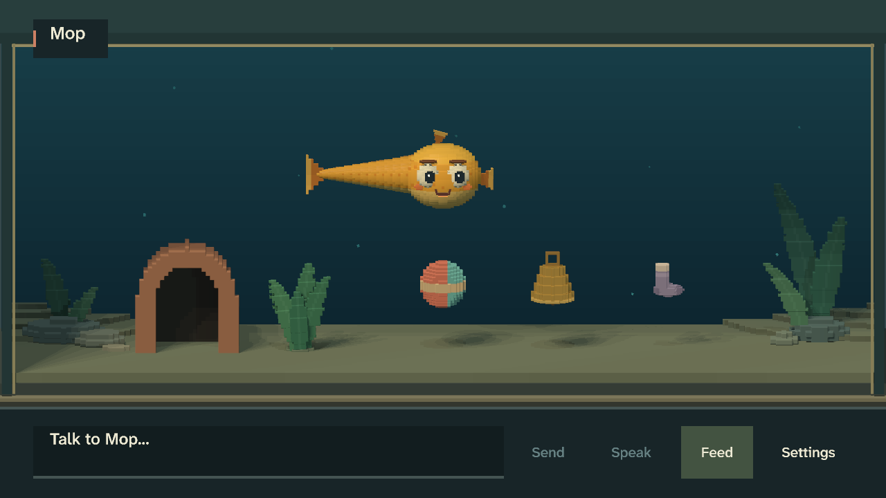
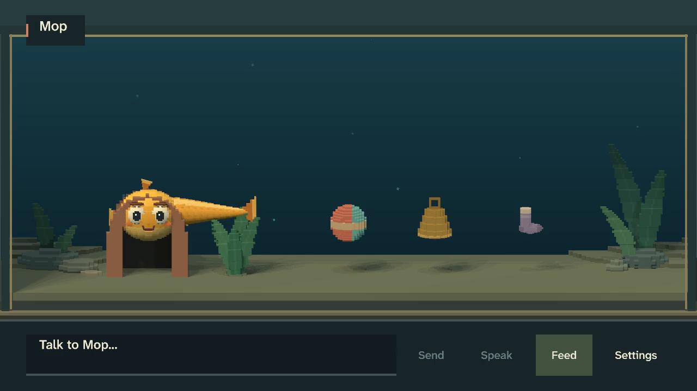

# Holistic feel review

Date: 2026-09-08. Review baseline: `33cdabaa1ac9bdb68a9a74e44d768984ae28ae44`.

## Judgment

Mop has a recognizable face and a life between commands. The weaker part is the surrounding
experience: the opening invitation emphasizes language, the belongings resemble a display row,
and shelter occupation exposes a mismatch between creature pose and habitat geometry. Two audio
issues also warrant work: decorative sounds trigger foreground ducking, and the reference
soundtrack does not reproduce runtime playback decisions.

The preferred next pass is [creature presence and care](creature-presence-and-care.md). Keep the
current renderer and creature identity; improve discovery, authored physical relationships and
semantic audio. This review proposes implementation. It does not claim those changes are made.

A further causal finding concerns deferred language: older waiting words can interrupt the
embodied refusal to a newer toy offer. The refusal remains visible, but its owned approach is
aborted. Fixing that ordering belongs in the same pass.

## Experience and evidence

The review asks whether a new player can start caring for Mop, enjoy quiet company, understand
acceptance/refusal and technical failure, and notice a relationship without needing conversation.
The baseline includes first use, three minutes of quiet life, an interaction chain, dialogue races,
bad conditions and accelerated relationship windows with and without optional language.

Fresh evidence lives under `target/feel/holistic-20260908/`, generated by:

```sh
cargo xtask feel --suite baseline --output target/feel/holistic-20260908
```

The normal debug game binary is
`52e35166907e11626f19d3e578e1ae5c34d584d23bf7d515a4e45600fb7f22ea`, on macOS/Metal,
1280x720 at recorded 60 fps, seed 42. Manifests retain scenario/binary/artifact hashes and backend
choices per experience. The suite started clean; review-document edits during capture do not
change its executable. No release binary, installer or model bundle was built.

Independent visual, causality and audio reviewers examined raw evidence. Visual review used the
full chronological first-five and quiet overview sets, event strips and selected native-size
frames; the main reviewer independently checked representative findings. These tools cannot
provide human full-speed video perception or listening. The prescribed full-speed subjective
review is therefore incomplete, rather than silently substituted with a claim that filmstrips
prove motion quality. Timestamps below refer to recorded playback, not wall time.

Supplemental `target/captures/tabletop-final-ui/` images cover existing Normal/Large UI. Their
provenance is recorded in [the tabletop review](feel-review-tabletop.md); they are not fresh
captures from this review. Baseline semantic actions do not establish actual first-use discovery.

Representative native frames are retained in the repository so the two principal visual
observations survive cleanup of the large ignored evidence bundles:





## Findings

### H1. The invitation to talk is clearer than the invitation to care

- Evidence: first-five-minutes `00:00.000`, `captures/00-first-frame.png`, and the persistent rail
  throughout `filmstrips/overview-001.png` through `overview-013.png`.
- Observation: the 680-pixel-wide message field occupies more than half the 1280-pixel opening
  frame's control rail. Feed is the only explicit embodied-care action. Comfort and play appear
  after selecting the creature; the initial image supplies no instruction to do so. Hover labels
  identify the creature by name rather than explaining the available care interaction.
- Intended reading: a creature to observe, touch, feed and play with, which can also hear language.
- Actual reading: my visual judgment is that the clearest task offered by the interface is to type
  a message. This is a hierarchy/discoverability concern, not proof that a first-time human fails.
- Severity: medium. Likely layer: view hierarchy and first-use guidance.
- Direction: reduce resting compose emphasis, provide one restrained care invitation and meaningful
  creature/toy hover/focus descriptions, and keep text immediately usable.
- Acceptance: native care discovery sequence, Normal/Large compose regression coverage and an
  unaided human discovery check. Avoid tutorial chores, extra meters or new persistent prompts.

### H2. Speak loses the instructions that distinguish it from a click button

- Evidence: first-five-minutes `00:00.000`, plus `beastie-view/src/lib.rs` functions
  `add_persistent_bar`, `microphone_label` and `add_hover_and_focus`.
- Observation: the rail renders only “Speak.” The hit-region description contains “Hold to talk”
  or “Microphone disabled in Settings,” but hover/focus presentation filters disabled controls and
  returns for non-world controls. Neither explanation is rendered. Pointer-down begins capture
  and pointer release ends it. Sound settings do contain the microphone control.
- Intended reading: hold while speaking, release to send; if disabled, know where to enable it.
- Actual reading: the visible title omits the operating gesture and disabled recovery route.
- Severity: medium. Likely layer: stateful control descriptions and focus accessibility.
- Direction: expose state-specific guidance without restoring redundant tooltips on every button.
- Acceptance: disabled pointer hover/click and keyboard/controller focus reveal recovery; enabled
  input explains hold/release; listening and recognizing remain distinct. No implicit activation.

### H3. Resting belongings look arranged as a selector row

- Evidence: first-five-minutes `00:00.000`, `03:00.000`, `05:00.266` and the full overview sequence;
  quiet-observation overviews independently reproduce the initial arrangement.
- Observation: ball, bell and sock are evenly spaced at one midwater height, with visible gaps
  above the sand. The creature moves around them, but the row persists through ordinary idle time.
- Intended reading: three particular belongings within a shared habitat.
- Actual reading: an aesthetic judgment that they resemble selectable display props. Recognizable
  silhouettes have improved, but the common height and unsupported appearance weaken physicality.
- Severity: medium. Likely layer: authored forms/resting composition, with canonical-position
  ownership if placement changes are required.
- Direction: give each object a coherent resting, buoyant or supported reading and compose the
  set with the habitat. Do not independently offset visual targets from authoritative contact.
- Acceptance: same-seed quiet and all three toy interactions, including carrying, refusal,
  interruption, picking and legacy saves. A rearranged still alone is insufficient.

### H4. Shelter rest makes the arch intersect the creature's head silhouette

- Evidence: first-five-minutes around `02:48` through `03:50`, native-size extraction at
  `03:00.000`; quiet-observation independently reproduces the fit at `02:12.000`.
- Observation: while the face is framed by the entrance, the crown and brow cross the roof/arch
  outline and the trailing body extends sideways above adjacent planting. The overlap holds
  during settled rest rather than appearing only during a passing turn.
- Intended reading: Mop has settled in or is peeking out of a shelter sized for it.
- Actual reading: the shelter and rest pose appear authored independently. The face remains
  readable, but the fit looks like interpenetrating geometry rather than snug occupation.
- Severity: medium. Likely layer: local shelter geometry and creature rest-pose composition.
- Direction: author the opening and pose together, preserving the face, body continuity, existing
  destination and arrival semantics. This does not require a 3D navigation/collision system.
- Acceptance: full approach, held rest, turns and departure in quiet and familiar-cave evidence,
  including the original pose. Verify presented-transform picking after changes.

### H5. Ambient bubbles trigger the duck reserved for creature vocalization

- Evidence: first-five-minutes `audio.jsonl`, isolated bubble at `00:15.016`; by `00:15.416`,
  `ambience_duck` is `0.630957`, about -4 dB. Repeated bubble bursts reproduce the pattern.
  `beastie-game/src/audio.rs::AudioBank::update_ducking` considers every queued/active one-shot.
- Observation: a background bubble reduces the background bed despite no foreground creature
  voice or speech. There are 20 bubble bursts across first-five-minutes and 12 across quiet.
- Intended reading: the ambience stays steady until foreground expression needs room.
- Actual behavior: ambient decoration receives foreground priority. Audible pumping or annoyance
  is unassessed because this review cannot listen to host output.
- Severity: medium. Likely layer: runtime semantic mix roles.
- Direction: distinguish ambience, UI, physical effects, creature voice and speech. Preserve the
  documented creature/speech envelopes and existing owner cancellation.
- Acceptance: isolated bubble/UI/physical traces do not acquire creature ducking; vocalization
  and speech do. Compare listening evidence after faithful reference rendering is available.

### H6. The reference soundtrack cannot verify the sound of interruption

- Evidence: `crates/xtask/src/feel.rs::generate_reference_mix`, all generated
  `session-audio-reference.mp4` and `reference-mix.wav` files in this baseline. In interaction-chain,
  `speech-001.wav` starts at `01:00.516` and runtime stops it at the direct comfort input,
  `01:01.316`. The 1.283628-second WAV nevertheless runs for another 483.628 ms in the reference.
- Observation: the generator places queued cue IDs and full speech WAVs at their start times with
  fixed gains and constant ambience. It does not reconstruct stop/cancel commands, actual active
  playback lifetimes, settings or the recorded duck envelope. Cue IDs are recorded before runtime
  arbitration, so a queued sound is not proof it started. A limiter also means an unclipped result
  alone cannot certify the underlying gain decisions.
- Intended reading: synchronized reference audio explains the audible consequences of runtime
  ownership, interruption and mix policy.
- Actual capability: it illustrates a requested cue schedule. It cannot support the stronger
  playback claim. The manifest correctly says host audio was not captured, but that distinction
  alone does not explain these additional reconstruction limits.
- Severity: high for evidence validity, not a demonstrated player-facing crash or sound defect.
  Likely layer: capture trace and offline audio reconstruction.
- Direction: record accepted playback decisions, retained sound bytes, owners, cancellation and
  gains after arbitration, then reconstruct those decisions offline. Keep host capture distinct.
- Acceptance: deterministic cancellation/mute/duck/overlap fixtures and pre-limiter measurements;
  explicit unavailable-output behavior; no microphone/private-text capture added.

### H7. Older deferred words abort the newer refusal's approach

- Evidence: interaction-chain `00:27.400` toy rejection, `00:27.416` interruption/submitted talk;
  contrast the repeated rejection at `00:30.433`. See `events.jsonl`, `state.jsonl` and
  `filmstrips/05-disliked-toy-001.png` / `06-repeat-disliked-toy-001.png`.
- Observation: bell refusal creates interaction #2 and a `RefusalStare` travel owner. On the next
  recorded frame, earlier deferred speech submits a Talk action and interrupts #2, clearing its
  destination and switching steering to Hover. The repeated refusal retains approach through
  about `00:31.000`. Suspicion, bell gaze and `refuse_and_stare` intention survive the first
  interruption, so this is not erased refusal or lost canonical preference.
- Intended reading: the newest direct interaction gets its coherent embodied refusal; older
  deferred language resumes at a safe boundary.
- Actual behavior: owner replacement is treated as permission for the waiting utterance to
  interrupt the replacement, even though its current handoff is still WaitingForContact.
- Severity: medium. Likely layer: session deferred-input handoff. In
  `beastie-session/src/lib.rs::apply_deferred_speech`, `owner_finished` bypasses the current unsafe
  boundary; `beastie-core/src/simulation.rs::interrupt_toy_interaction` then clears refusal travel.
- Direction: distinguish completion of the remembered owner from permission to interrupt a new
  direct owner. Preserve expiry and cooldown-only liveness; do not globally delay all dialogue.
- Acceptance: replay this exact race with the new refusal owner retained through its safe boundary,
  no positive payoff/memory, no replayed refusal, and immediate response to genuinely new care.
  Test both typed and spoken deferrals and save/load of the owning interaction where supported.

## Strengths and rejected conclusions

- The warm, readable face remains the focal point against restrained water and planting. Normal
  and Large supplemental controls are legible; no new clipping finding is supported there.
- First-five food is offered at `00:36.133` and consumed at `00:54.166`. Ball selection at
  `00:54.200` reaches contact at `01:06.233`. The intervening movement is visible; these intervals
  do not establish lost input or justify universally faster outcomes. Settings cover the first
  ball contact in this scenario, so that particular filmstrip does not prove physical payoff.
- The first-five sequence creates shared-ball memory at `01:06.233`, followed by an unprompted
  history-backed ball approach at `02:10.250` through `02:17.250`. This is meaningful embodied
  continuity, not merely a counter changing in the save.
- Quiet observation includes bell attention/contact, autonomous ball displacement, plant pauses
  and shelter rest. Twenty initial quiet seconds do not establish a dead or command-bound animal.
- Quiet contains no speech or creature vocal chatter; its 12 bubble bursts span 7–18-second gaps
  with no variant run above two. No dialogue-spam or clock-like bubble-alternation finding survives.
- Runtime speech ownership is a strength: interaction-chain comfort at `01:01.316` stops the
  active reply immediately. Dialogue-races comfort at `00:01.200` supersedes the earlier pending
  request before any speech starts; its second request speaks at `00:33.200` with subtitles off,
  no caption owner and the correct mouth owner. The reference mix must be fixed to reflect this.
- Generated fixture wording is not evidence of real local-model personality, language quality or
  latency. This review does not propose a prompt/model replacement based on fixture replies.
- The no-AI sequence contains no Talk inputs or TTS playback, but does contain 482 caption-present
  frames after an initiated fallback at `00:45.133`. Early return at `00:24.050–00:32.066` is
  unobscured; the later return overlaps “you came back again.” This proves independence from
  generated language/TTS, not an entirely text-free relationship review. Require a matching
  subtitles-off comparison before claiming the latter.
- Do not reopen renderer architecture, add detail indiscriminately, or interpret every long pause
  as missing activity. The accepted problems are more specific than those changes.

## Coverage limits and follow-through

Human full-speed aesthetic judgment, listening/voice character, physical controller feel, real
microphone operation and real-model conversation remain unclaimed. The accelerated relationship
fixtures are bounded windows, not proof of weeks of attachment, language learning or rehabilitation.
Windows/Linux and lower-end GPUs remain separate native acceptance obligations.

The implementation contract requires faithful playback evidence, targeted relationship breadth,
an additional quiet seed, first-use input and repeated final native review. Missing coverage is
an evidence gap, not a finding that the game fails there. Known actual defects and aesthetic
judgments above remain separate from those gaps.

## Actual input and verification

The separate normal-debug OS-input session at `target/feel/holistic-native-20260908/` records
3,606 frames, 60.100 seconds, and eight host screenshots. It reuses the nonpersistent
`fixtures/scenarios/feel/native-first-use.jsonl` wait window with real pointer/keyboard events.
It is a raw input/video bundle, not a second canonical suite manifest.

Disabled Speak hover and the click at `00:01.833` produce no explanatory helper. Settings opens
at `00:03.133`, and the Sound & speech tab reveals Microphone Off. Food selection/drop succeeds
at `00:09.150`, creature context opens from the click at `00:12.416`, and actual character key
events plus Enter at `00:16.733` submit text. Food consumption and deferred Talk acceptance both
occur at `00:22.000`, consistent with waiting for the current food action. The screenshot named
`06-creature-hover` actually shows berry hover because the moving animal had changed position;
it does not certify creature hover. Context opening is independently visible in `07-context`.
The run did not enable the microphone or alter persistent settings.

All seven canonical manifests and all 181 listed artifact hashes/sizes validate. The same game
binary and seed are used throughout. No capture required a startup retry. The table reports
recorded video duration, not measured display cadence or GPU performance.

| Experience | Frames | Seconds | Hashed artifacts |
|---|---:|---:|---:|
| First five minutes | 18,021 | 300.350 | 34 |
| Quiet observation | 10,812 | 180.200 | 28 |
| Interaction chain | 3,757 | 62.617 | 28 |
| Dialogue races | 2,179 | 36.317 | 22 |
| Bad conditions | 2,603 | 43.383 | 23 |
| Relationship over time | 5,849 | 97.483 | 27 |
| Relationship without inference/TTS | 3,255 | 54.250 | 19 |
| Total | 46,476 | 774.600 | 181 |

Independent visual review covered chronological overviews of all seven experiences. The main
reviewer verified the accepted visual/causal findings and reviewed actual-input screenshots and
traces. Relationship-breadth, additional quiet seeds, fresh Large UI, physical microphone/controller
and host listening were not rerun. Their applicable follow-up acceptance is explicit in the
contract; none is silently counted as complete.

`cargo xtask verify` passed 492 tests, 27 dialogue fixtures, 11 STT fixtures and spoken-input
replay. The existing macOS compact-unwind linker warning remains non-fatal. This change contains
review documents and two evidence images only; no visible shell implementation was changed.

## Implementation disposition, 2026-09-08

All seven accepted findings are implemented, along with the additional issues discovered during
integration. See the [final implementation review](feel-review-creature-presence-20260908.md) for
H1–H7 dispositions, exact comparisons, independent reviews, saved-history breadth, a second quiet
seed, captions-off relationship evidence and actual Normal/Large microphone/care input. The
original observations and coverage limits above describe the pre-implementation review; the new
review records which gaps were closed and which human/hardware judgments remain unclaimed.
